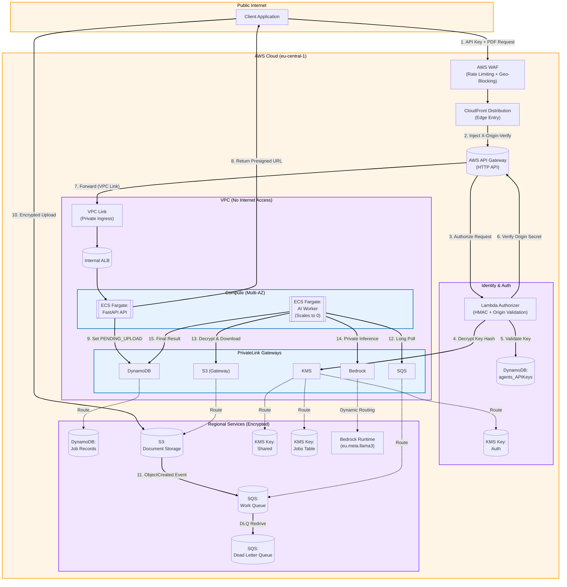

# SecureAgents: Zero-Trust AI Document Pipeline

SecureAgents is a high-security, B2B SaaS infrastructure designed for industries where data privacy is non-negotiable (Legal, Medical, Finance). It provides a fully automated pipeline that ingests sensitive PDF documents, processes them using private AI models, and returns structured insights, all while ensuring the data never touches the public internet.

---

## Project Structure

```text
.
├── .github/workflows/      # CI/CD Pipeline (Ruff + ECR/ECS Deploy)
├── agent-api/              # FastAPI application (Ingress & Status)
├── agent-worker/           # Python worker (PDF Processing & Bedrock AI)
├── bootstrap/              # Terraform for remote state (S3/DynamoDB)
├── lambda-authorizer/      # Zero-Trust HMAC & Origin validation logic
├── scripts/                # Management scripts (API Key rotation)
└── terraform/              # Main infrastructure (VPC, ECS, WAF, etc.)
```

---

## Zero-Trust Security & Isolation Architecture

SecureAgents is built on a "Deny-by-Default" principle. Below are the key pillars of our isolation strategy:

### 1. Zero-Egress VPC Design
- **No Internet Gateway:** The VPC contains no Internet Gateway (IGW). All compute resources (ECS Fargate) live in strictly private subnets.
- **VPC Endpoints (PrivateLink):** Communication with AWS services (S3, DynamoDB, SQS, KMS, Bedrock) occurs entirely over the AWS private network backbone. Data never traverses the public internet.
- **Security Group Hardening:** Egress is restricted to only the necessary VPC Endpoints via Prefix Lists, preventing data exfiltration even if a container is compromised.

### 2. The "Double-Shield" Ingress
- **Edge Protection:** Traffic first hits AWS WAF (Rate Limiting + Geo-Blocking) and CloudFront.
- **Origin Validation:** API Gateway is configured with a Lambda Authorizer that requires a secret `X-Origin-Verify` header, ensuring traffic *must* come from CloudFront and cannot bypass the WAF.
- **VPC Link:** API Gateway connects to an **Internal-Only Application Load Balancer** via a VPC Link. This means the ALB has no public DNS or IP address.

### 3. Cryptographic Data Privacy
- **KMS Managed Keys:** Every service (S3, DynamoDB, SQS, ECR, CloudWatch) uses Customer Managed Keys (CMKs) for AES-256 encryption.
- **Transient Storage:** Documents in S3 are automatically purged after 30 days via lifecycle policies.
- **Private Inference:** Bedrock cross-region inference is utilized via VPC Endpoints, ensuring that document content is processed within the AWS perimeter and never used for model training.

---


SecureAgents was built with a "Security First, Cloud Second" mindset. We use a defense-in-depth strategy that starts at the edge and goes deep into the VPC.



### Key Architectural Decisions (ADRs)

1.  **WAF & CloudFront (Edge Defense):**
    - **Decision:** Use AWS WAF attached to CloudFront with a custom `X-Origin-Verify` header requirement at the API Gateway.
    - **Why?** Protects against DDoS and common web exploits (SQLi, XSS) before traffic reaches our infrastructure. The custom header ensures that users cannot bypass the WAF by hitting the API Gateway endpoint directly.
2.  **API Gateway + Internal ALB (The Double Shield):**
    - **Decision:** Split public ingress from private compute using a VPC Link.
    - **Why?** Ensures our application servers have **no public IP addresses**. They live in strictly private subnets, accessible only through the API Gateway.
3.  **On-Demand Compute (Scale-to-Zero):**
    - **Decision:** Fargate for both API and Worker nodes, with a specific focus on **scaling the Worker to zero**.
    - **Why?** PDF processing and LLM orchestration are bursty. The Worker service maintains a `desired_count = 0` when the SQS queue is empty, automatically spinning up when new documents arrive. This eliminates idle compute costs while ensuring 24/7 availability.
4.  **Amazon Bedrock (Private Inference):**
    - **Decision:** Serverless AI via Bedrock (Llama 3 8B).
    - **Why?** Ensures data is **never used to train base models**. Via VPC Endpoints, data travels from S3 to Bedrock over the AWS private network, never crossing the public internet.
5.  **SQS Standard vs. FIFO:**
    - **Decision:** SQS Standard Queue.
    - **Why?** For document processing, absolute ordering isn't required, but high throughput and "at-least-once" delivery are critical. FIFO adds complexity and cost that aren't justified for this use case.

---

## Prerequisites & Environment Setup

### Required Tools

- **Terraform:** `>= 1.5`
- **Python:** `3.11`
- **AWS CLI:** `v2`
- **Docker:** (For building images)
- **Ruff:** (Optional, for local linting)

### Deployment IAM Permissions

The user/role deploying the stack needs a policy covering:

- `AdministratorAccess` (recommended for initial setup) OR fine-grained permissions for: EC2 (VPC/SGs), ECS, ECR, S3, DynamoDB, SQS, KMS, Bedrock, IAM, CloudFront, WAF, and Lambda.

## Deployment

This project uses a highly secure, isolated remote state. Deployment is a two-phase process:

**Phase 1: Bootstrap the Control Plane**

1. Navigate to the `bootstrap/` directory.
2. Run `terraform init` and `terraform apply`.
3. When complete, Terraform will output values for the main stack `backend` code block in terraform/providers.tf.
4. Copy that block and paste it into your main `terraform/providers.tf` file.

**Phase 2: Deploy the Application**

1. Navigate to the `terraform/` directory.
2. Run `terraform init` (this connects to your newly created secure S3 state).
3. Run `terraform apply` to deploy the main infrastructure.

### First-Run Expectations (The ECR Hack)

> ** Note on Initial Deployment:**
> To allow Terraform to deploy ECS and ECR in a single click, the initial `terraform apply` pushes a 0-byte "dummy" image to the registries.
>
> Immediately after your first deployment, your ECS tasks will briefly enter a "CrashLoopBackOff" state. **This is expected and completely fine.** Once your GitHub Actions CI/CD pipeline runs and pushes the real Python application code, ECS will automatically recover and spin up healthy containers.

---

## CI/CD Pipeline (GitHub Actions)

The project includes a production-ready CI/CD pipeline in `.github/workflows/actions.yml`:

1.  **Code Quality:** Automatically runs `ruff` to check formatting and linting rules.
2.  **Deployment:** On merge to `main`, builds Docker images for both API and Worker, pushes them to ECR, and triggers an ECS rolling update.
3.  **Security:** Uses OIDC (OpenID Connect) for AWS authentication—no static long-lived AWS keys are stored in GitHub Secrets.

_Note: To use the CI/CD, you must update the IAM Role ARN in `actions.yml` to match the one generated by `terraform/iam_github.tf`._

---

## AI Model Access (Amazon Bedrock)

This architecture utilizes **Meta Llama 3 8B Instruct** via Amazon Bedrock. Because AWS now automatically enables serverless foundation models on the first invocation, **no manual console configuration is required**.

The system is configured as an **Expert Legal Administrative Assistant**, providing high-density, 3-sentence objective summaries of legal and professional documents.

_(Note: We utilize the `eu.` Cross-Region Inference prefix in Terraform to guarantee high availability and bypass regional hardware limitations in Frankfurt)._

---

## Environment Configuration (CORS)

By default, the API restricts Cross-Origin Resource Sharing (CORS) to `http://localhost:3000` for local testing.

Before deploying to production, you **must** pass your frontend's domain to Terraform to prevent the API from rejecting your web traffic. Create a `terraform.tfvars` file in the `terraform/` directory:

```hcl
# terraform/terraform.tfvars
allowed_origins = "https://your-production-frontend.com,http://localhost:3000"
```

---

## API Integration Flow

This API uses an asynchronous, Zero-Trust upload architecture. Clients do not send files directly through the API Gateway.

1. **Request a Slot:** `POST /api/v1/request-upload`. The API returns a secure, presigned S3 URL (valid for 30 minutes) and registers the job as `PENDING_UPLOAD`.
2. **Direct Upload:** The client securely uploads the PDF directly to the S3 URL using the provided cryptographic headers.
3. **Poll Status:** The client polls `GET /api/v1/jobs/{job_id}`. Once S3 finishes receiving the file, it automatically triggers the AI worker, moving the state to `PROCESSING` and eventually `COMPLETED`.

---

## Operational Runbooks

### 1. Rotating Client API Keys

To rotate a key without downtime:

1.  Generate a new key: `python scripts/client_key_script.py --client-id "ClientName"`
2.  Provide the new key to the client.
3.  Once the client confirms they have switched to the new key, an Administrator safely deactivates the old one using the management script:

    ```bash
    python scripts/client_key_script.py --deactivate "ak_live_123456789..."
    ```

    This instantly blocks the key at the Edge (`active = false`) and applies a 90-day TTL (`expires_at`), ensuring the hash remains available for security audits before DynamoDB automatically deletes it.
    - _Note: For security, neither the API nor the Worker have permissions to modify this table._

### 2. Handling Stuck Jobs & DLQ

If a job is stuck in `PROCESSING` for > 15 minutes or fails 3 times, it moves to the `agents-dlq`.

- **Check DLQ:** `aws sqs receive-message --queue-url <DLQ_URL>`
- **Reprocess:** Use the AWS Management Console to "Start DLQ redrive" back to the main queue, or manually fix the issue (e.g., Bedrock quota reached) and redrive.
- **Stuck Jobs:** Check if the worker task crashed. Fargate will automatically restart it, but the job status in DynamoDB might need manual reset to `PENDING_UPLOAD` to allow a retry.

### 3. Scaling Workers Manually

Auto-scaling is based on SQS backlog (5 messages per task). To scale manually:

```bash
aws ecs update-service --cluster agents-cluster --service agents-worker-service --desired-count 5
```

### 4. Tailing Logs

All logs are centralized in CloudWatch.

- **API Logs:** `aws logs tail /aws/ecs/agents-api --follow`
- **Worker Logs:** `aws logs tail /aws/ecs/agents-worker --follow`
- **Authorizer:** `aws logs tail /aws/lambda/agents-authorizer --follow`

### 5. Clean Teardown

To destroy the stack without leaving orphaned resources:

1.  **Empty S3 Buckets:** `aws s3 rm s3://<BUCKET_NAME> --recursive`
2.  **Delete ECR Images:** `aws ecr batch-delete-image --repository-name agents-api --image-ids "$(aws ecr list-images --repository-name agents-api --query 'imageIds[*]' --output json)"`
3.  **Run Terraform:** `terraform destroy` (Note: KMS keys have a 7-30 day deletion window).

---

## Security Policy & Threat Model

### Threat Model

- **DDoS/Bot Attack:** Mitigated by AWS WAF rate-limiting and CloudFront geo-blocking.
- **API Key Theft:** Mitigated by hashing keys in DynamoDB and requiring `X-Origin-Verify` headers to prevent direct Gateway access.
- **Data Exfiltration:** Mitigated by Zero-Egress VPC design; containers have no path to the public internet.
- **Unauthorized Data Access:** S3 and DynamoDB policies restrict access strictly to the VPC Endpoints and Task Roles.

### Data Handling Policy

- **Transient Storage:** Documents are stored in S3 only for the duration of processing.
- **Implemented Auto-Deletion (30-Day TTL):**
  - **Jobs Table:** Records expire after 30 days (auto-deleted by DynamoDB TTL).
  - **API Keys:** Deactivated keys expire after 90 days.
  - **S3 Storage:** S3 lifecycle policies automatically purge all documents and versions after 30 days.

### Compliance Posture

SecureAgents is designed to be **HIPAA and SOC 2 ready**. It uses AES-256 encryption at rest (KMS), TLS 1.2+ in transit, and maintains detailed audit logs in CloudWatch and DynamoDB PITR.

---

## API Reference

### Base URL

- **CloudFront URL:** `https://<distribution-id>.cloudfront.net` (Get this from `terraform output`)

### 1. Request Upload Slot

`POST /api/v1/request-upload`

- **Header:** `x-api-key: <your-key>`
- **Body:** `{"filename": "document.pdf"}`
- **Success (202):**
  ```json
  {
    "job_id": "uuid",
    "upload_url": "s3-presigned-url",
    "required_fields": {...},
    "instructions": "..."
  }
  ```

### 2. Check Job Status

`GET /api/v1/jobs/{job_id}`

- **Header:** `x-api-key: <your-key>`
- **Success (200):**
  ```json
  {
    "job_id": "uuid",
    "status": "COMPLETED",
    "created_at": "timestamp",
    "result": "Objective 3-sentence legal summary..."
  }
  ```

### Error Codes

- `401 Unauthorized`: Missing/Invalid API Key or bypassed CloudFront.
- `404 Not Found`: Job ID does not exist or belongs to another client.
- `429 Too Many Requests`: WAF or API Gateway rate limit exceeded.

---

## Testing Documentation

### Local Development

The apps use Pydantic for configuration. You can run them locally by pointing to real AWS resources (if you have local creds):

```bash
cd agent-api
export S3_BUCKET_NAME=your-bucket
export DYNAMODB_JOBS_TABLE=agents_Jobs
uvicorn app.main:app --reload --port 8000
```

### Testing the Lambda Authorizer

To test the authorizer without deploying, use the AWS Lambda console with a "Test Event" (JSON version 2.0):

```json
{
  "headers": {
    "x-api-key": "your-raw-key",
    "x-origin-verify": "your-origin-secret"
  }
}
```

If successful, it should return `{"isAuthorized": true, "context": {"client_id": "..."}}`.

### End-to-End Test (curl)

```bash
# 1. Request Upload
curl -X POST https://<CF_URL>/api/v1/request-upload \
     -H "x-api-key: ak_live_..." \
     -H "Content-Type: application/json" \
     -d '{"filename": "contract.pdf"}'

# 2. Upload File (example using fields from step 1)
curl -X POST <upload_url> \
     -F "key=..." -F "x-amz-server-side-encryption=aws:kms" \
     -F "file=@contract.pdf"

# 3. Poll for Status
curl -H "x-api-key: ak_live_..." https://<CF_URL>/api/v1/jobs/<job_id>
```

---

## Estimated Monthly Costs

We optimized for a "Pay-as-you-Grow" model while maintaining enterprise-grade security.

| Service                | Estimated Cost   | Logic                                                   |
| :--------------------- | :--------------- | :------------------------------------------------------ |
| **Edge Defense (WAF)** | ~$7 - $15        | Base cost for Web ACL + Rate Limit rules.               |
| **VPC Endpoints**      | ~$75 - $100      | S3, SQS, KMS, Bedrock, ECR. Replaces NAT Gateway costs. |
| **Compute (Fargate)**  | ~$25 - $40       | 2x small API tasks + fluctuating workers (scales to 0). |
| **Load Balancing**     | ~$20             | Internal ALB base cost for high availability.           |
| **Database & Storage** | ~$5              | S3, DynamoDB, SQS (pay-per-request/GB).                 |
| **AI (Bedrock)**       | Variable         | Billed per 1,000 tokens (Llama 3 is highly affordable). |
| **Total Base**         | **~$135 - $185** | Production-grade security for less than $5/day.         |

- **Fargate Scaling:** Max capacity is capped at 5 workers in `scaling.tf` to prevent runaway costs during queue floods.
- **Billing Alerts:** Configure a CloudWatch Billing Alarm for $200/month (the base cost of the stack).
- **Per-Job Cost:** Using Llama 3 on Bedrock, the AI cost is ~$0.0001 per document, making the infrastructure base cost the primary driver.

---

## License

This project is licensed under the MIT License - see the [LICENSE](LICENSE) file for details.
