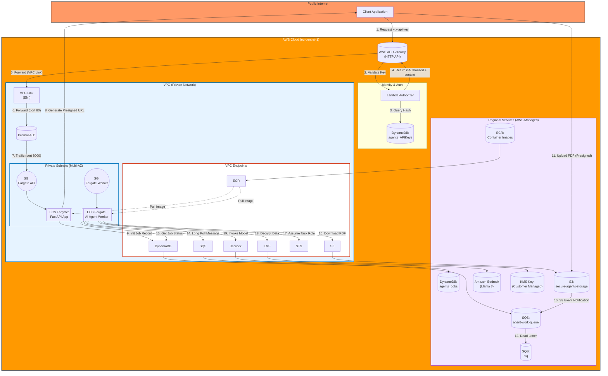

# SecureAgents: Zero-Trust AI Document Pipeline

SecureAgents is a high-security, B2B SaaS infrastructure designed for industries where data privacy is non-negotiable (Legal, Medical, Finance). It provides a fully automated pipeline that ingests sensitive PDF documents, processes them using private AI models, and returns structured insights—all while ensuring the data never touches the public internet.

---

## The Architecture: Why We Made These Decisions

Modern AI applications often sacrifice privacy for speed. SecureAgents was built with a "Security First, Cloud Second" mindset.


### 1. API Gateway + Internal ALB (The Double Shield)

We use **Amazon API Gateway** as our public entry point to handle authentication via a custom Lambda Authorizer. However, the actual FastAPI application sits behind an **Internal Application Load Balancer (ALB)**.

- **Decision:** Split public ingress from private compute.
- **Why?** This separation ensures our application servers have **no public IP addresses**. They live in strictly private subnets, accessible only through the API Gateway's VPC Link. This eliminates a huge class of direct-to-server attacks.

### 2. AWS Fargate vs. Lambda

- **Decision:** Fargate for both API and Worker nodes.
- **Why?**
  - **Consistent Performance:** PDF processing and LLM orchestration often exceed Lambda's 15-minute timeout or memory limits.
  - **Worker Long-Polling:** Our workers use SQS long-polling to minimize costs while maintaining a persistent connection, which is more efficient for high-volume pipelines than frequent Lambda cold starts.
  - **Deep Monitoring:** Fargate allows us to implement kernel-level security monitoring (like eBPF) which isn't possible in the Lambda runtime.

### 3. Amazon Bedrock (Private Inference)

- **Decision:** Serverless AI via Bedrock.
- **Why?** Unlike public AI APIs, Bedrock ensures your data is **never used to train the base models**. By using **VPC Interface Endpoints**, the data travels from our private S3 bucket to Bedrock over the AWS private network, never crossing the public internet.

### 4. No NAT Gateway (Zero-Egress Design)

- **Decision:** Rely entirely on VPC Endpoints.
- **Why?** NAT Gateways are expensive ($30+/month base) and create a path for data exfiltration. Our "Zero-Egress" approach means our containers **cannot call home** or talk to anything except the specific AWS services they need to function.

---

## Core Strengths (The Zero-Trust Moat)

- **Network Isolation:** NACLs and Security Groups strictly enforce "Private Only" traffic.
- **Encrypted by Default:** Every byte at rest (S3/DynamoDB) and in transit (TLS 1.2+) is protected by customer-managed **KMS keys**.
- **Asynchronous Reliability:** SQS acts as a durable buffer. Even if the AI model is slow, no document is lost.
- **Dynamic Scaling:** The worker fleet scales from **0 to 5** automatically based on the SQS backlog, ensuring you only pay for what you use.
- **Identity First:** Every request is authenticated at the edge by a Lambda Authorizer before it even touches the internal network.

---

## Project Structure: Every File Explained

```text
SecureAgents/
├── agent-api/                  # FastAPI Ingestion Service
│   ├── app/
│   │   ├── __init__.py         # Package initialization
│   │   ├── aws_client.py       # Boto3 wrappers for S3, SQS, DynamoDB
│   │   ├── config.py           # Environment-based configuration (Pydantic)
│   │   └── main.py             # FastAPI routes & logic
│   ├── authorizer.py           # Lambda code for API Key validation
│   ├── client_key_script.py    # Utility to create & hash client API keys
│   ├── .dockerignore           # Prevents local junk from entering containers
│   ├── .env.example            # Template for local environment variables
│   ├── Dockerfile              # Multi-stage build (Builder + Runtime)
│   └── requirements.txt        # Python dependencies (FastAPI, Boto3, etc.)
│
├── agent-worker/               # AI Processing Daemon
│   ├── app/
│   │   ├── __init__.py         # Package initialization
│   │   ├── config.py           # Environment-based configuration
│   │   └── main.py             # SQS Listener & Bedrock Orchestrator
│   ├── .dockerignore           # Keeps worker images lean
│   ├── .env.example            # Worker environment template
│   ├── Dockerfile              # Lightweight worker container
│   └── requirements.txt        # Python dependencies (pypdf, etc.)
│
└── terraform/                  # Infrastructure as Code (AWS)
    ├── alb.tf                  # Internal Load Balancer config
    ├── api_gateway.tf          # Public API Gateway & Lambda Authorizer
    ├── backend.tf              # S3/DynamoDB state locking (commented out)
    ├── compute.tf              # ECS Cluster & Fargate Task Definitions
    ├── data.tf                 # Dynamic AWS data (AZs, Account ID, etc.)
    ├── dynamodb.tf             # Tables for Jobs and API Keys
    ├── ecr.tf                  # Container Registries for API and Worker
    ├── iam.tf                  # Fine-grained IAM Roles & Policies
    ├── kms.tf                  # Encryption Key Management (Central CMK)
    ├── nacl.tf                 # Network Access Control Lists (Subnet Firewalls)
    ├── network.tf              # VPC, Private Subnets, and Interface Endpoints
    ├── outputs.tf              # Key deployment values (API URL, etc.)
    ├── providers.tf            # AWS Provider & Global Tagging
    ├── s3.tf                   # Secure Storage Vault with Versioning
    ├── scaling.tf              # SQS-based Auto-scaling for Workers
    ├── security.tf             # Security Groups (Stateful Firewalls)
    ├── sqs.tf                  # Work Queue & Dead Letter Queue (DLQ)
    └── variables.tf            # Input variable definitions
```

---

## Cost Efficiency (Estimated Monthly)

We optimized for a "Pay-as-you-Grow" model while maintaining high security.

| Service                | Estimated Cost  | Logic                                                   |
| :--------------------- | :-------------- | :------------------------------------------------------ |
| **VPC Endpoints**      | ~$35 - $50      | S3, SQS, KMS, Bedrock, ECR. Replaces NAT Gateway costs. |
| **Compute (Fargate)**  | ~$25 - $40      | 2x small API tasks + fluctuating workers (scales to 0). |
| **Load Balancing**     | ~$20            | Internal ALB base cost for high availability.           |
| **Database & Storage** | ~$5             | S3, DynamoDB, SQS (pay-per-request/GB).                 |
| **AI (Bedrock)**       | Variable        | Billed per 1,000 tokens (Llama 3 is highly affordable). |
| **Total Base**         | **~$85 - $115** | Production-grade security for less than $4/day.         |

---

## Getting Started

### 1. Infrastructure Deployment

Navigate to the terraform directory and deploy the stack:

```bash
cd terraform
terraform init
terraform apply
```

### 2. Prepare the API Key

Generate a secure key for a client and store it in DynamoDB:

```bash
python agent-api/client_key_script.py --client-id "LawFirm_A"
```

### 3. The Processing Workflow

1.  **Request Access:** `POST /api/v1/request-upload` with your API Key.
2.  **Upload:** Use the returned pre-signed URL to upload a PDF directly to S3.
3.  **Automatic Trigger:** S3 notifies SQS -> SQS wakes up the Fargate Worker.
4.  **AI Analysis:** The Worker extracts text, summarizes via Bedrock, and saves to DynamoDB.
5.  **Check Result:** `GET /api/v1/jobs/{job_id}` to retrieve the final summary.

---

## Security Compliance

- **GDPR:** Data stays within your specified AWS Region.
- **Encryption:** AES-256 via KMS CMK.
- **Privacy:** Bedrock inference is isolated; no data leaks to model training.
